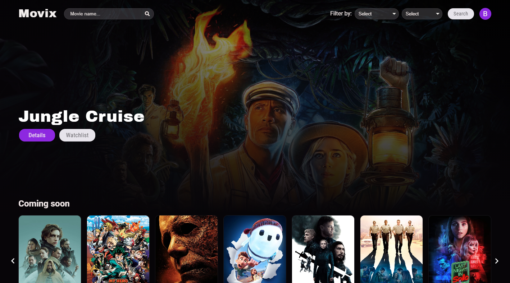
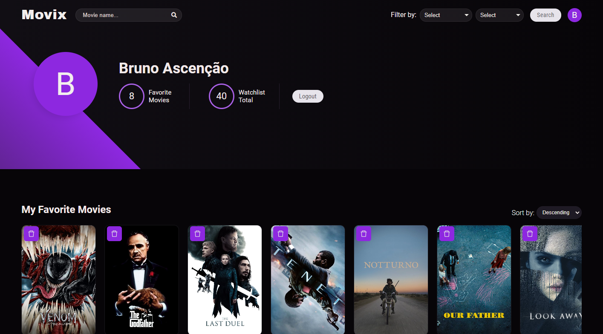

## Movix

O Movix é um site para descobrir e pesquisar seus filmes favoritos. No app é possível salvar seus filmes favoritos em uma lista ou adicioná-lo na watchlist.

- [MOVIXAPP](https://movixapp.netlify.app/)

## Login

Para que seja possível adiconar filmes à sua lista lista, é necessário efetuar o login no movixapp.

## Autenticação

Todo o sistema de login é feito atraves da api do site [TheMovieDB](https://developers.themoviedb.org/3/getting-started/introduction), é necessário que o usuário crie uma conta e autorize o movixapp na utilização de seus dados.

## User

Depois de ter autorizado o movixapp na utilização de seus dados será possível adicionar filmes na lista de favoritos e watchlist.

## Instalação e configuração.

Faça um clone desse repositório. Tenha instalado `npm` e `node` na sua máquina.

Instalação:

`npm install`

Para iniciar o servidor:

`npm start`

## Tecnologias utilizadas

- [TheMovieDBAPI](https://developers.themoviedb.org/3/getting-started/introduction)
- [ReactJS](https://pt-br.reactjs.org/)
- [Redux](https://redux.js.org/)
- [SwiperJS](https://swiperjs.com/react)
- [React icons](https://react-icons.github.io/react-icons/)
- [FontAwesome](https://fontawesome.com/)
- [SASS](https://sass-lang.com/)
- [axios](https://github.com/axios/axios)
- [react-modal-video](https://www.npmjs.com/package/react-modal-video)
