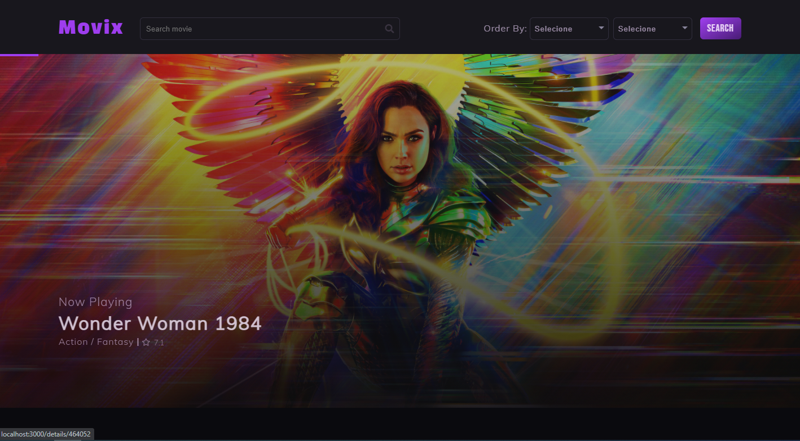

## Movix

Projeto tem como objetivo fornecer um catálogo de filmes para aquelas pessoas que estão em dúvida sobre qual filme assistir. No site também é possível ver as datas dos filmes mais próximos em cartaz.

* URL: (https://movixapp.netlify.app/)

## Screenshots

## Instalação e configuração.

Faça um clone desse repositório. Tenha instalado `npm` e `node` na sua máquina.

Instalação:

`npm install`  

Para iniciar o servidor:

`npm start`  

Para visitar o site:

`localhost:3000/`  

## Tecnologias utilizadas

* ReactJS
* Swiper JS (https://swiperjs.com/react)
* axios (https://github.com/axios/axios)
* React icons (https://react-icons.github.io/react-icons/)
* FontAwesome (https://fontawesome.com/)
* Redux (https://redux.js.org/)